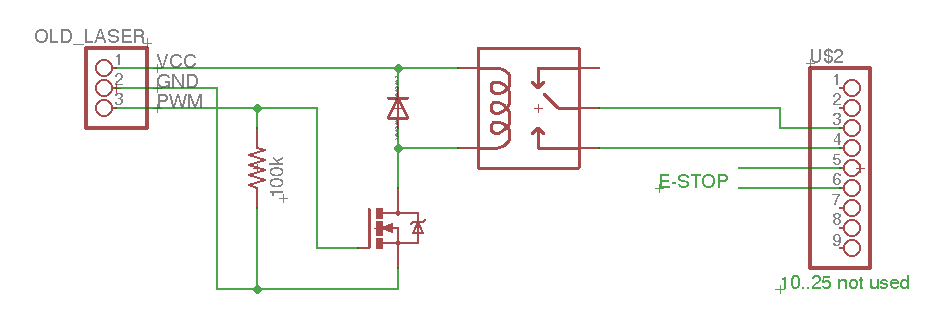

XPhotonics X1 Pro CNC connections
====================================

This is a quick list of the setup and connections to turn the X1 Pro into a CNC laser cutter.

Video of usage/connections:

https://www.youtube.com/watch?v=91UyzMzQsJs


XY Bed
--------

I used an old laser engraver I had kicking around that ran GRBL firmware (which takes GCode). You can buy one of these without a laser for around £100 - [see here on Aliexpress](https://vi.aliexpress.com/item/1005006965556808.html)


Circuit
---------



All you need to do is use the signal that was meant for the laser diode to control a relay
which acts as a switch for a 'dry contact' output.

**Note:** this was all very quickly put together with what I had on hand. An easier/better option might
be [a purpose-built relay board](https://www.amazon.co.uk/Channel-Optocoupler-Isolation-Support-Trigger/dp/B07XYQQDX8/ref=sr_1_1_sspa) or
[an optoisolator like this](https://www.amazon.co.uk/Optocoupler-Isolation-Channel-Isolated-Processors/dp/B07YHQBCZ7/ref=sr_1_1_sspa)
but I haven't tested either.

* Resistor - not required but without one if the 'PWM' wire became disconnected then it could float and turn the laser on
* FET - I used a P36NF06L [like this](https://www.amazon.co.uk/PCS-transistor-P36NF06L-STP36NF06L-220/dp/B0F52Y1Z9C/ref=sr_1_1) because I had some around - but you can use pretty much any N-Channel FET
* Relay (12v) - I used a car one with wires [like this](https://www.amazon.co.uk/Gebildet-Harness-Color-labeled-Automotive-Motorcycle-5-Pin/dp/B0778J4WQW/ref=sr_1_6) because I had one but there is no need for such a big one
* 3 pin connector - my laser had a 3 pin PHR connector [like this](https://www.amazon.co.uk/Micro-Connector-150mm-Cable-Female/dp/B01DU9OY40/ref=sr_1_7)
* 25 way connector (X1 Pro) - This is known as a D25/DB25/D-SUB connector. I used two [like this](https://www.amazon.co.uk/TUCKBOLD-Female-Solder-Connectors-Automotive/dp/B0DDP13L6W/ref=sr_1_5_sspa) which I wired together to connect all pins through so I could use the E-stop. You could of course just add wires to the existing E-Stop


Mechanical connection
-----------------------

I just cut/welded a bit of aluminium to hold the laser.

I did design a 3D printed holder but I haven't yet tried it. Files are:

* [OpenSCAD source](xlaserlab.scad)
* [Actual STL file](xlaserlab.stl)


Software
-----------

You just use it like you would have the original laser cutter. However you need to wait after turning the laser on/off since it doesn't respond immediately (you can change settings in the laser but even so there will be some delay). You can use the `G4` (Dwell) GCode command for this (I used 0.5 seconds) - your laser tool might provide you with the ability to change the laser-on command, and if so just place `G4 P0.5` after `M3` (motor/laser on) and `M5` (motor/laser off).

In the end I just modified the GRBL firmware to add a delay so I didn't have to worry, but rebuilding/reflashing the GRBL firmware is probably more than most people want to do!

```
diff --git a/grbl/gcode.c b/grbl/gcode.c
index 6075250..c4f5d29 100644
--- a/grbl/gcode.c
+++ b/grbl/gcode.c
@@ -945,6 +945,7 @@ uint8_t gc_execute_line(char *line)
     // rather than gc_state, is used to manage laser state for non-laser motions.
     spindle_sync(gc_block.modal.spindle, pl_data->spindle_speed);
     gc_state.modal.spindle = gc_block.modal.spindle;
+    delay_sec(0.5, DELAY_MODE_DWELL); // wait 0.5s after changing laser state
   }
   pl_data->condition |= gc_state.modal.spindle; // Set condition flag for planner use.
```